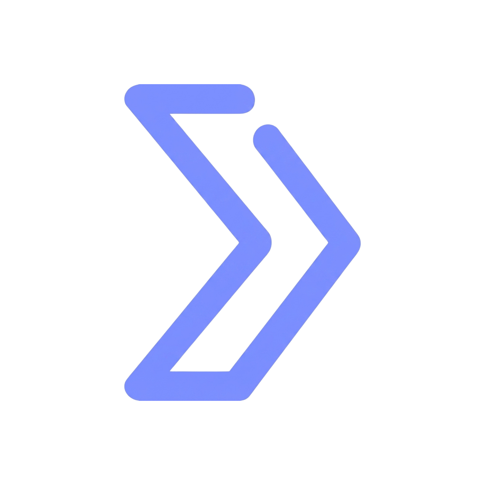
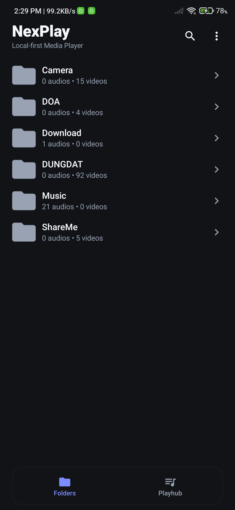
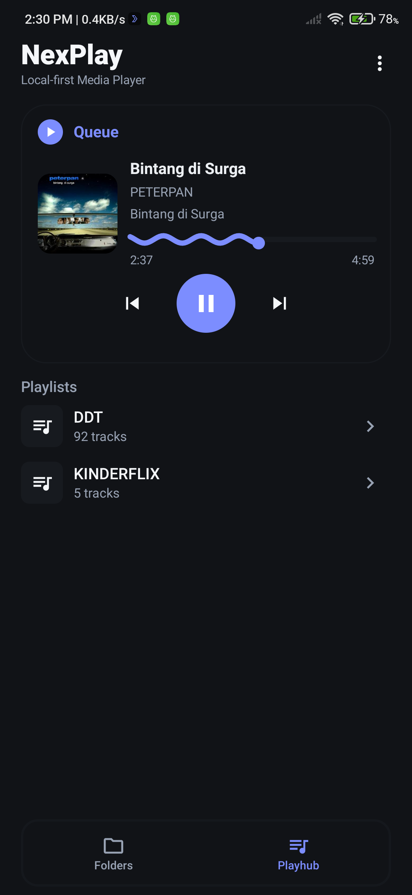
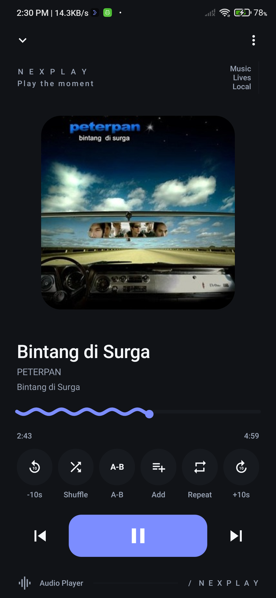
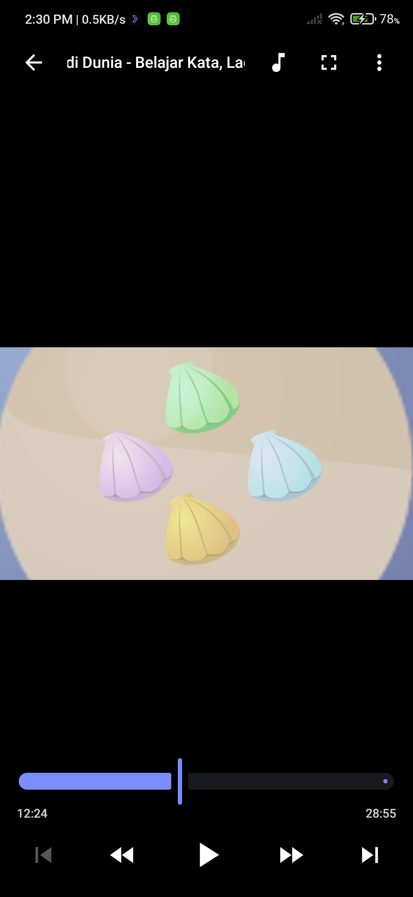
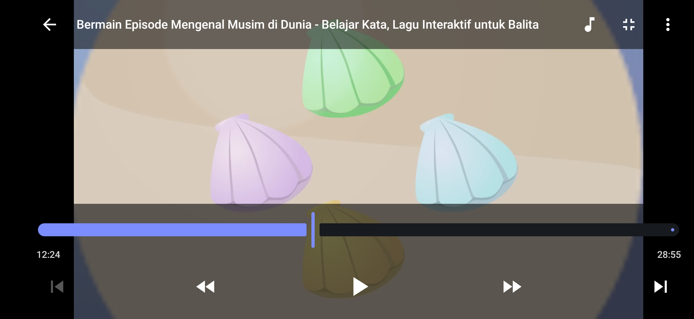
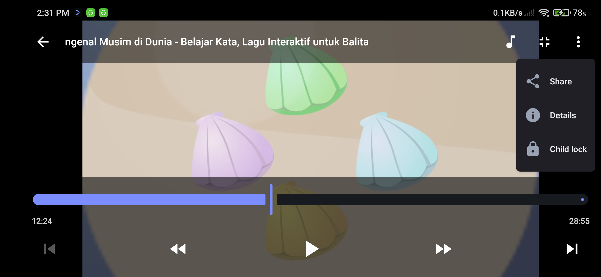

<p align="center">
  
</p>

<h1 align="center">NexPlay</h1>

<p align="center">
  <strong>Play Everything.</strong><br>
  One focused, native Android player for the music and videos already on your device.
</p>

<p align="center">
  No account required for core playback. No cloud media library required.
</p>

<p align="center">
  <a href="https://developer.android.com/about/versions/marshmallow"></a>
  <a href="https://kotlinlang.org/"></a>
  <a href="https://developer.android.com/compose"></a>
  <a href="https://developer.android.com/media/media3"></a>
  <a href="LICENSE"></a>
</p>

<p align="center">
  <a href="https://github.com/fahmirizrev/NexPlay/releases/latest"></a>
  <a href="https://github.com/fahmirizrev/NexPlay/releases"></a>
  <a href="https://github.com/fahmirizrev/NexPlay/stargazers"></a>
</p>

<p align="center">
  <strong><a href="https://github.com/fahmirizrev/NexPlay/releases/latest">Download NexPlay</a></strong>
  &nbsp;·&nbsp;
  <a href="https://github.com/fahmirizrev/NexPlay/releases">All Releases</a>
  &nbsp;·&nbsp;
  <a href="https://github.com/fahmirizrev/NexPlay/issues">Report an Issue</a>
  &nbsp;·&nbsp;
  <a href="docs/BUILDING.md">Build from Source</a>
</p>

---

## Why NexPlay?

NexPlay keeps local playback direct: your device, your library, one player.

<table>
  <tr>
    <td width="33%" valign="top">
      <strong>🎵 Music + video together</strong><br><br>
      Browse and play local audio and video without splitting your library across separate apps.
    </td>
    <td width="33%" valign="top">
      <strong>📂 Built around folders</strong><br><br>
      Move through media the way it is organized on your device, then search, sort, or build playlists.
    </td>
    <td width="33%" valign="top">
      <strong>🎧 Native Android control</strong><br><br>
      Continue audio in the background with MediaSession, notification, lock-screen, headset, and Bluetooth controls.
    </td>
  </tr>
  <tr>
    <td width="33%" valign="top">
      <strong>🎬 Video that adapts</strong><br><br>
      Switch a video to Audio Only, move between portrait and landscape, or protect fullscreen controls with Child Lock.
    </td>
    <td width="33%" valign="top">
      <strong>🔒 Local-first by design</strong><br><br>
      Core discovery and playback work with device media and do not require an account or cloud library.
    </td>
    <td width="33%" valign="top">
      <strong>🤖 Android-native</strong><br><br>
      A focused Kotlin and Jetpack Compose application powered by one Media3 playback runtime.
    </td>
  </tr>
</table>

## Download

### NexPlay 1.0.0

The current public baseline supports **Android 6.0 / API 23 and newer**.

<p>
  <a href="https://github.com/fahmirizrev/NexPlay/releases/latest"><strong>Download the latest official release →</strong></a>
</p>

Official signed APKs are published only through the NexPlay GitHub Releases page.
Use the SHA-256 checksum published with a release to verify the downloaded
artifact, and avoid unofficial mirrors unless you trust their source.

## Features

| | Area | What NexPlay provides |
|---|---|---|
| 🎵 | **Audio** | Full Audio Player, background playback, Audio Mini Player, embedded artwork, shuffle, repeat, and A-B Repeat |
| 🎬 | **Video** | Portrait and landscape playback, fullscreen controls, Video Audio Only, and fullscreen Child Lock |
| 📂 | **Library** | Folder-first browsing, media search, sorting, fast scrolling, playlists, queue access, sharing, and media details |
| 🎧 | **Android integration** | MediaSession, notification and lock-screen controls, headset/Bluetooth transport, and Android Open With support |
| 🔒 | **Local-first & privacy** | No NexPlay account or cloud media library for core playback, plus local playlist and preference persistence |
| 🎨 | **Experience** | System, Light, and Dark themes with persisted user choices |

## See NexPlay in Action

Every image below is captured from the real Android application.

### Music & Library

<table>
  <tr>
    <td align="center" width="33%"><strong>Folders</strong></td>
    <td align="center" width="33%"><strong>PlayHub</strong></td>
    <td align="center" width="33%"><strong>Audio Player</strong></td>
  </tr>
  <tr>
    <td align="center"></td>
    <td align="center"></td>
    <td align="center"></td>
  </tr>
</table>

### Video

<table>
  <tr>
    <td align="center" width="24%"><strong>Video Player</strong></td>
    <td align="center" width="38%"><strong>Fullscreen</strong></td>
    <td align="center" width="38%"><strong>Child Lock</strong></td>
  </tr>
  <tr>
    <td align="center"></td>
    <td align="center"></td>
    <td align="center"></td>
  </tr>
</table>

## Technology

NexPlay is built natively for Android with:

<p align="center">
  <strong>Kotlin</strong> · <strong>Jetpack Compose</strong> · <strong>Material 3</strong> · <strong>Media3 / ExoPlayer</strong><br>
  Coroutines · StateFlow · Room · DataStore · MediaStore · MediaSession
</p>

Its architecture keeps ownership deliberately small and explicit:

```text
MediaStore → Media Library → QueueEngine → QueuePlaybackCoordinator
           → PlaybackEngine → Single ExoPlayer → App UI + MediaSession
```

Read the [architecture guide](docs/ARCHITECTURE.md) for component boundaries and
ownership rules.

## Privacy

NexPlay is designed for media stored on or exposed to your Android device. Core
media discovery and playback do not require network access, a NexPlay account,
or a cloud-hosted library. Playlists and application preferences are stored
locally.

Read the full [privacy model](docs/PRIVACY.md).

## Build from Source

Run the project from the repository root with a supported JDK and Android SDK:

```powershell
.\nexplay_kotlin\gradlew.bat -p nexplay_kotlin testDebugUnitTest
.\nexplay_kotlin\gradlew.bat -p nexplay_kotlin lintDebug
.\nexplay_kotlin\gradlew.bat -p nexplay_kotlin assembleDebug
```

The debug APK is written to:

```text
nexplay_kotlin/app/build/outputs/apk/debug/app-debug.apk
```

See [Building NexPlay](docs/BUILDING.md) for setup, testing, device installation,
and signed-release instructions.

## Documentation

- [Architecture](docs/ARCHITECTURE.md) — media, queue, playback, persistence, and UI ownership
- [Building](docs/BUILDING.md) — local verification, APK builds, and device commands
- [Privacy](docs/PRIVACY.md) — local data, media permissions, and network behavior
- [Release Process](docs/RELEASE.md) — signing, verification, and publication discipline
- [Changelog](CHANGELOG.md) — factual public release history
- [License](LICENSE) — GPL-3.0-only terms

## Contributing

Issues and focused contributions are welcome. Before submitting a change:

1. inspect the relevant implementation and architecture boundary;
2. keep the change scoped and preserve unrelated behavior;
3. run the checks appropriate to the change;
4. validate affected runtime behavior on Android when applicable.

Use [GitHub Issues](https://github.com/fahmirizrev/NexPlay/issues) for reproducible
bugs and focused proposals. Project-specific engineering rules are in
[AGENTS.md](AGENTS.md).

## License

NexPlay is free and open-source software licensed under
[GNU GPL v3.0 only](LICENSE).

Copyright © 2026 FRZDEV.

---

<p align="center"><strong>Built for people who keep their media library with them.</strong></p>
